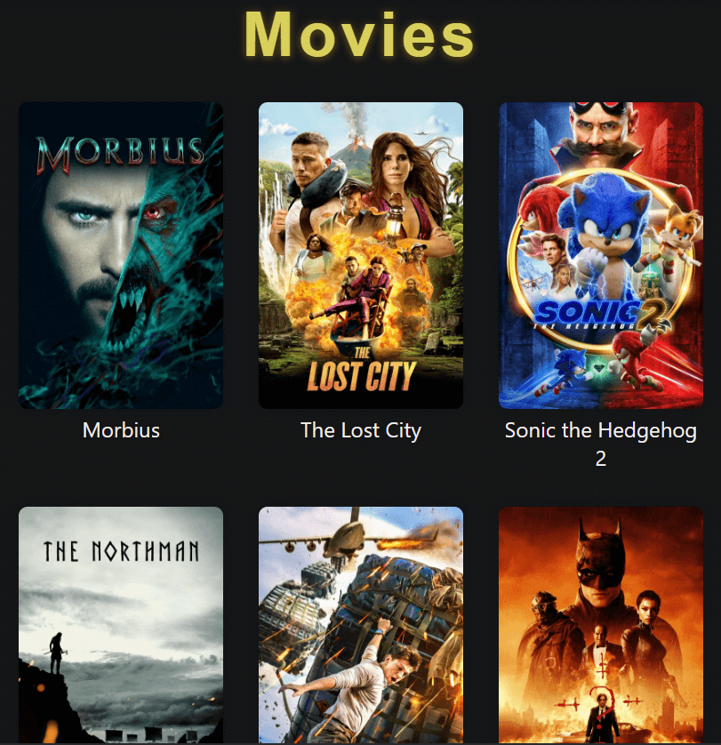

# Movies API

Frontend application using The Movie Database API. Built with React ⚛️.
[Try it out here 🙌.](https://movies-react-tmdb.herokuapp.com)

# Installation

1. Clone the whole project and/or unzip the file.
2. Run the following in the root folder:
3. Run `npm install`
4. Create the .env file in the root directory
5. Add the `REACT_APP_BEARER_AUTHORIZATION` and `REACT_APP_CONTENT_TYPE` variables. You can request an API key by logging in to your account on TMDb and clicking the "API" [link](https://developers.themoviedb.org/3/getting-started) in the left hand side bar of your account page.
6. Run `npm start`

---

